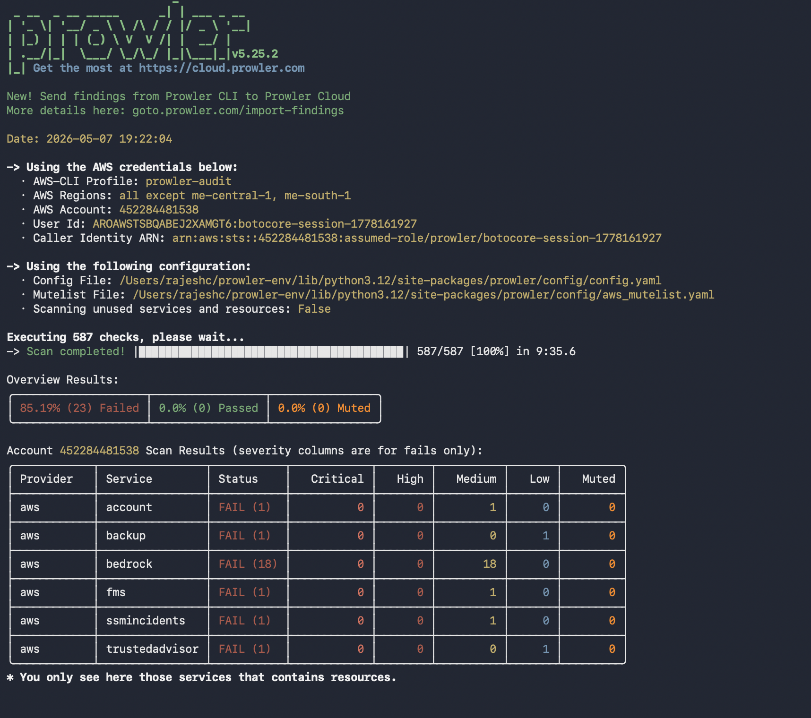
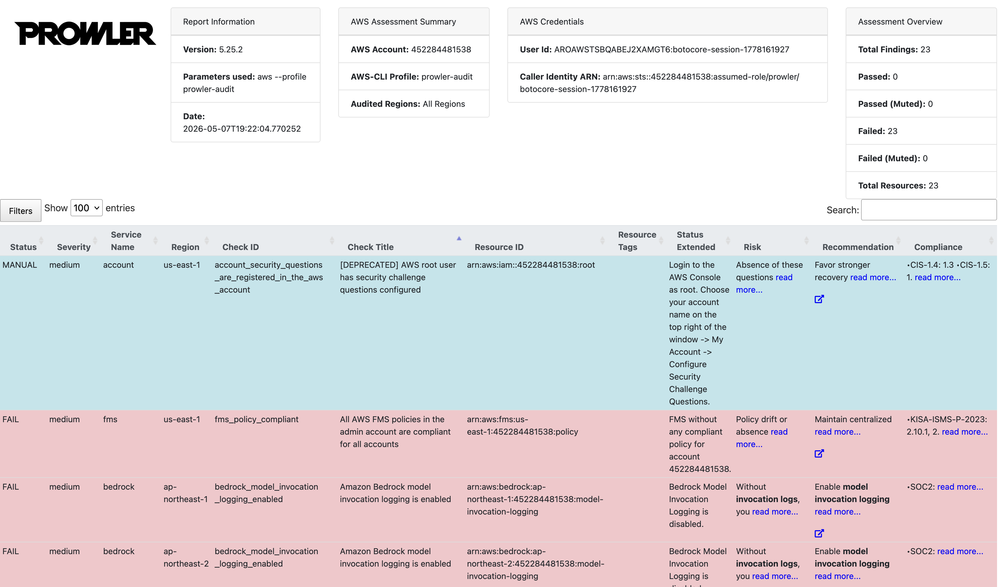

# AWS Security Audit using Prowler


---

# Overview

This project demonstrates how to perform automated AWS cloud security assessments using Prowler with secure authentication via IAM AssumeRole.

The objective of this project is to evaluate the security posture of an AWS environment, identify misconfigurations, validate compliance against security benchmarks, and document remediation recommendations.

The assessment was conducted using temporary AWS STS credentials obtained through AssumeRole authentication, following AWS security best practices.

---

# Project Objectives

- Configure secure AWS cross-account access using IAM AssumeRole
- Perform automated AWS security audits using Prowler
- Identify cloud security misconfigurations and compliance gaps
- Generate actionable security findings and reports
- Document remediation recommendations
- Demonstrate cloud security and DevSecOps practices

---

# Technologies Used

- AWS IAM
- AWS STS AssumeRole
- Prowler
- AWS CLI
- Python
- Bash
- CIS AWS Foundations Benchmark

---

# Architecture Workflow

```text
+-------------------+
| Local Workstation |
+-------------------+
          |
          v
+-------------------+
| AWS CLI Profile   |
+-------------------+
          |
          v
+-------------------+
| STS AssumeRole    |
+-------------------+
          |
          v
+-------------------+
| Temporary AWS     |
| Credentials       |
+-------------------+
          |
          v
+-------------------+
| Prowler Scan      |
+-------------------+
          |
          v
+-------------------+
| Findings & Reports|
+-------------------+
```

---

# IAM AssumeRole Configuration

A dedicated IAM role was configured in the target AWS account with security audit permissions.

The local AWS CLI profile was configured to assume the role using temporary STS credentials.

## Example AWS CLI Configuration

```ini
[profile prowler-audit]
role_arn = arn:aws:iam::<ACCOUNT_ID>:role/SecurityAuditRole
source_profile = default
region = us-east-1
```

> Note: Sensitive identifiers and account information have been sanitized.

---

# Prowler Installation

## Install using pip

```bash
pip install prowler
```

## Verify installation

```bash
prowler -v
```

---

# Running Security Scans

## Full AWS Scan

```bash
prowler aws --profile prowler-audit
```

## Targeted Service Scan

```bash
prowler aws --profile prowler-audit --services iam s3 ec2
```

## Generate Reports

```bash
prowler aws --profile prowler-audit -M html csv json
```

---

# Security Checks Performed

The assessment included security checks across multiple AWS services, including:

- IAM
- S3
- EC2
- CloudTrail
- CloudWatch
- VPC
- EBS
- Security Groups
- Logging and Monitoring
- Encryption Controls
- MFA Enforcement

---

# Sample Findings

| Severity | Finding | AWS Service |
|----------|----------|-------------|
| High | Root account MFA not enabled | IAM |
| High | Publicly accessible S3 bucket detected | S3 |
| Medium | Unused IAM access keys | IAM |
| Medium | Security groups allowing unrestricted SSH access | EC2 |
| Low | CloudTrail not enabled in all regions | CloudTrail |

---

# Remediation Recommendations

- Enable MFA for the AWS root account
- Enforce least-privilege IAM policies
- Restrict public access to S3 buckets
- Enable encryption for storage services
- Remove unused IAM credentials
- Restrict inbound traffic on security groups
- Enable centralized logging and monitoring
- Ensure CloudTrail is enabled in all AWS regions

---

# Sample Report Output

Example report formats generated:

- HTML Report
- CSV Findings
- JSON Output

```text
output/
├── prowler-output.html
├── prowler-findings.csv
└── prowler-results.json
```


---

# Key Learnings

- Gained hands-on experience with AWS IAM AssumeRole authentication
- Learned cloud security auditing methodologies
- Improved understanding of AWS security best practices
- Practiced compliance validation using CIS benchmarks
- Developed experience in security reporting and remediation planning
- Strengthened DevSecOps and cloud governance skills

---

# Future Improvements

- Integrate scans into CI/CD pipelines
- Automate scheduled security assessments
- Integrate findings with AWS Security Hub
- Add multi-account scanning support
- Implement automated remediation workflows
- Create dashboards for findings visualization

---

# Screenshots

## Prowler Scan Output



## Findings Dashboard




---

# Security Disclaimer

This repository is intended for educational and demonstration purposes only.

All sensitive information including account identifiers, credentials, ARNs, and findings have been sanitized before publication.

---

# Author

## Rajesh Chippagiri

Cloud Security | DevSecOps | AWS Security Engineering

---

# License

This project is licensed under the MIT License.
